# PASERIE (V1R1M2)
### Utility for Source-Level Distribution in IBM i

This utility helps you maintain your IBM i source code on GitHub.
Once available on a target system, the utility allows you to install your packages 
in a very simple way, directly accessing your repositories on GitHub
or the repositories of other developers that authorized you.

The suite provides a total of three commands:

* For end users of a package:
  *  **PASERIE/INSTALL** the main command focusing on the installation phase of an already developed and GitHub-released package.
* For developers:
  *  **PASERIE/INSTALLOC** the command used in the development phase to test the installation of a package (planned to be released on GitHub or not) directly from a directory in the IFS.
  *  **PASERIE/LIBCLONE** the command used to jump\-start the packaging (consistently with PASERIE tools' conventions) from an existing native library. 


```
    from GitHub                  from IFS 
┌────────────────┐          ┌────────────────┐    
│                ├┐         │                ├┐   
│                ││         │                ││   
│                ││         │                ││   
│                ││         │                ││   
│                ││         │                ││   
└┬──────\\───────┘│         └┬──────//───────┘│
 └───────\\───────┘          └─────//─────────┘  
          \\                      //
        INSTALL               INSTALLOC
            \\                  //
             \\                //
              ┌────────────────┐
              │                │
              │   Q T E M P    │     (GUIDANCE.TXT lists source members)
              │                │
              └────────────────┘
                     
              QTEMP/QCLSRC(BUILD)    (compiled on the fly and executed)   
```
<div style="page-break-after: always;"></div>

## INSTALLATION

I assume you have **bash**, **git** and **curl** installed in your *PASE* environment.
Skip to the end of this document otherwise. 
From `CALL QP2TERM`, you can verify that **bash**, **git** and **curl** are installed:

```
  $                                        
> PATH=/QOpenSys/pkgs/bin:$PATH            
  $                                        
> export PATH                              
  $                  
> which bash
  /QOpenSys/pkgs/bin/bash
  $
> which curl
  /QOpenSys/pkgs/bin/curl
  $         
> which git
  /QOpenSys/pkgs/bin/git
```

Using curl download the following archive (supporting IBM i 7.3, 7.4, 7.5 and 7.6):
                                                                      
```                  
curl -o PaseOssFloating.tar
        https://www.andrearibuoli.it/paserie/PaseOssFloating.tar    
```

From *the home path of the user* that will be using *PASERIE/INSTALL* we
install **PaseOss** folder by untarring *PaseOssFloating* tar file:

```
cd ~
tar xvf PaseOssFloating.tar
```

Now, still from *the home path of the user* that will be using *PASERIE/INSTALL* we
perform:

```
cd ~
git clone https://github.com/AndreaRibuoli/PASERIE.git
cd PASERIE
bash ./bootstrap.sh
```

Given the limitations in [PUB400.COM](https://www.pub400.com), to install PASERIE there 
\-a free and public IBM i enviroment\- replace the last command with a dedicated script: 
`bash ./bootstrap_pub400.sh`.

After exiting from the QP2TERM session you should have **PASERIE** utilities available. 


<div style="page-break-after: always;"></div>

## THE NAME

pastry ==> *pâ-tis-se-rie* ==> **PASERIE**


## PARAMETERS FOR THE THREE COMMANDS WITH SCREEN SHOTS

|     KWD    |  INSTALL  | INSTALLOC | LIBCLONE  |
|:-----------|:---------:|:---------:|:---------:|
| REPO_OWNER |    yes    |           |           | 
| REPOSITORY |    yes    |           |           | 
| YOURGITPAT |    yes    |           |           | 
| SRCLIB     |           |           |    yes    | 
| LOCALPATH  |           |    yes    |    yes    | 
| TGTLIB     |    yes    |    yes    |           | 
| TGTRLS     |    yes    |    yes    |           | 
| DEVOPT     |    yes    |    yes    |    yes    | 
| LOGOUTPUT  |    yes    |    yes    |    yes    | 
| VERBOSE    |    yes    |    yes    |    yes    | 


<div style="page-break-after: always;"></div>

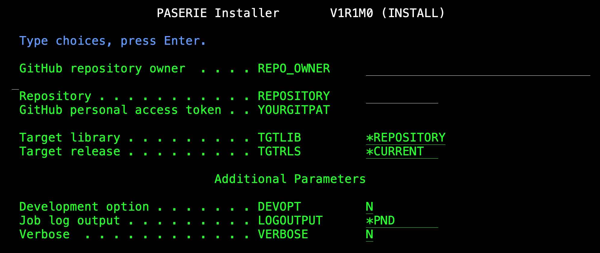

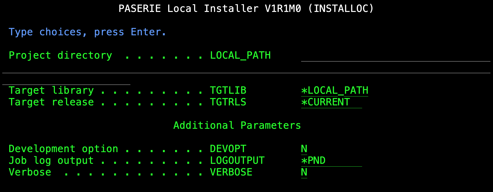

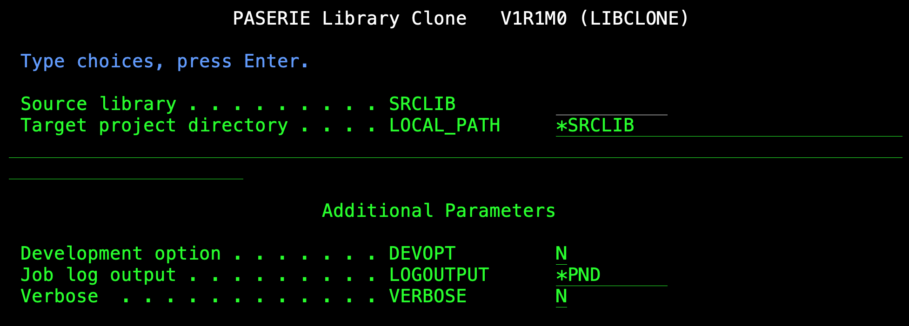

<div style="page-break-after: always;"></div>

On a system based in Italy the commands will be compiled from localized source files:

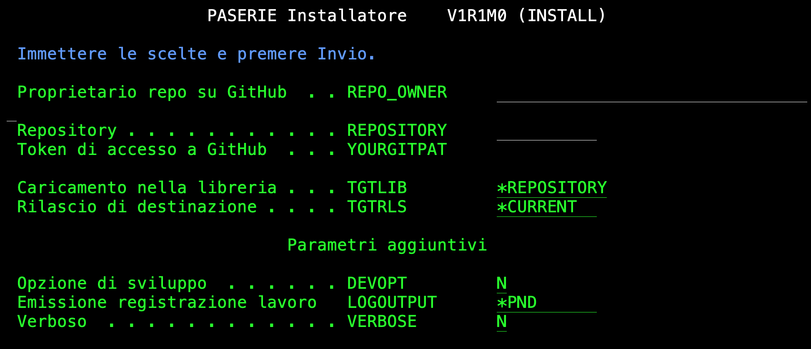

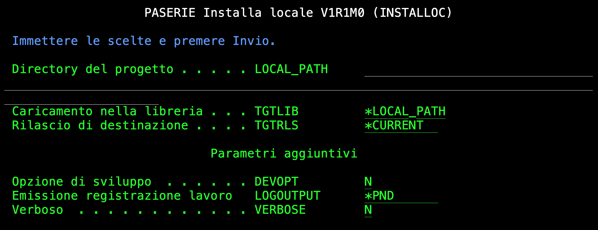

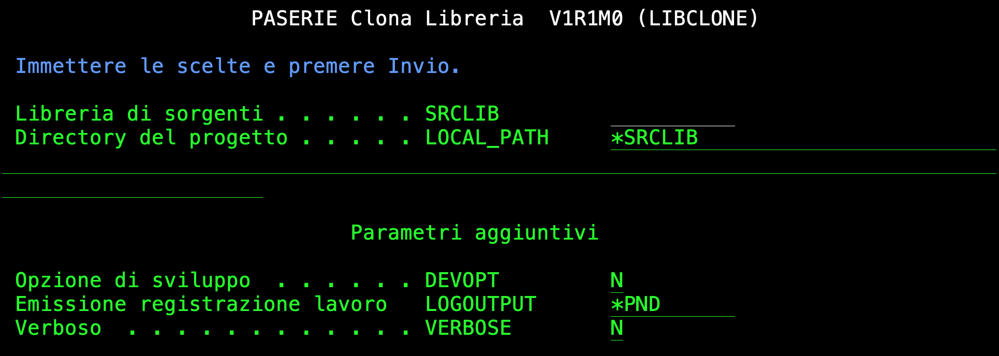

<div style="page-break-after: always;"></div>

On a system based in Germany the commands will be compiled from localized source files:

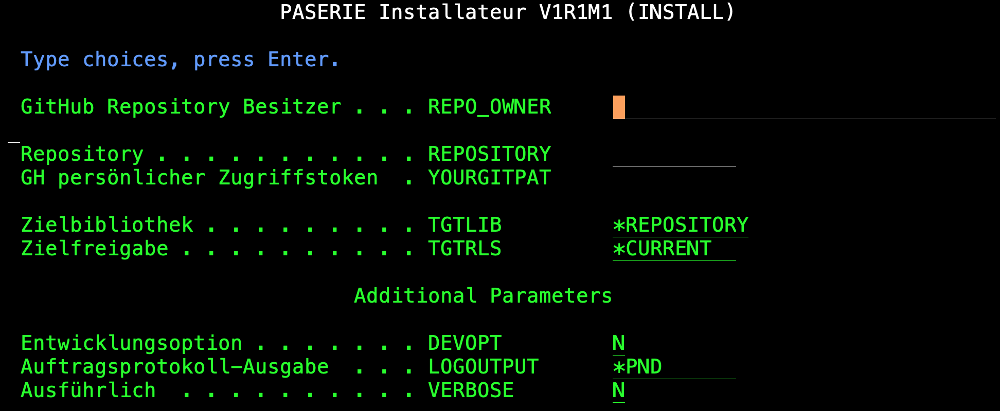

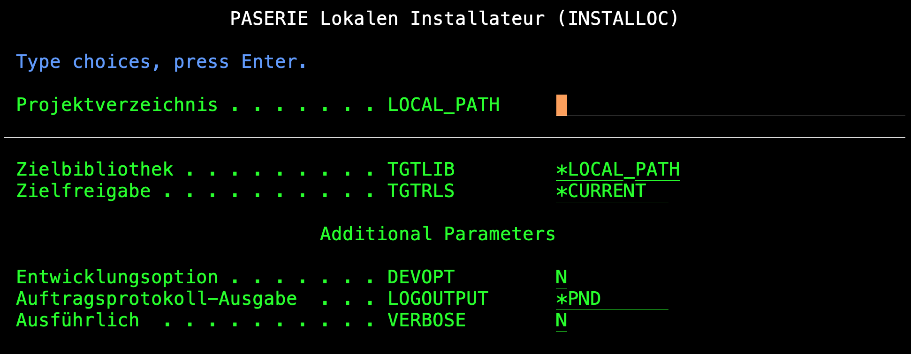

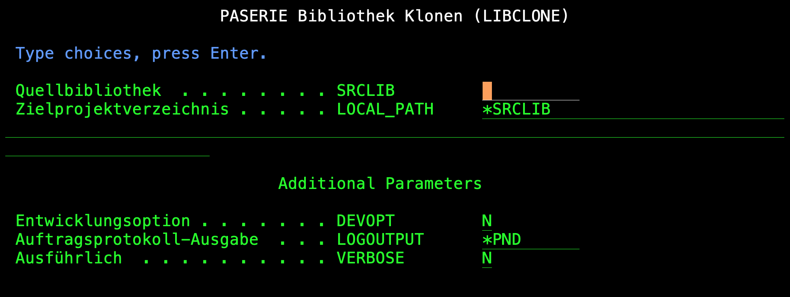

<div style="page-break-after: always;"></div>

On a system based in France the commands will be compiled from localized source files:

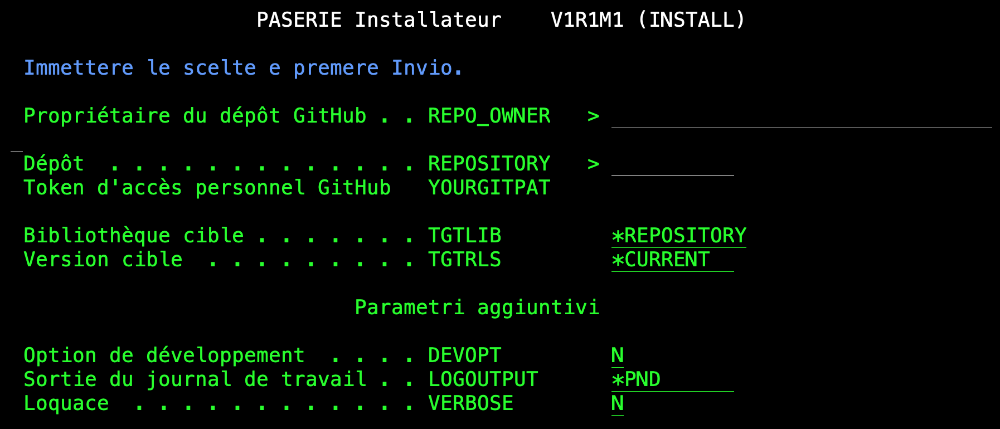

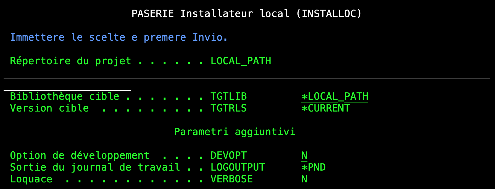

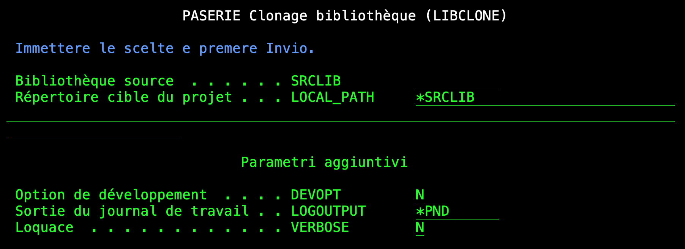

<div style="page-break-after: always;"></div>

## INVOKING PASERIE/INSTALL FROM SQL

``` SQL
SELECT PROGRAM_NAME, OBJECT_TYPE, TEXT_DESCRIPTION, CREATE_TIMESTAMP
 FROM QSYS2.PROGRAM_INFO WHERE PROGRAM_LIBRARY = 'PASERIE';
CALL QSYS2.QCMDEXC('PASERIE/INSTALL REPO_OWNER(AndreaRibuoli) REPOSITORY(PASERIE)');
SELECT PROGRAM_NAME, OBJECT_TYPE, TEXT_DESCRIPTION, CREATE_TIMESTAMP
 FROM QSYS2.PROGRAM_INFO WHERE PROGRAM_LIBRARY = 'PASERIE'
``` 

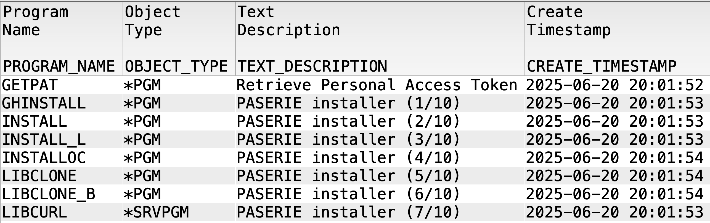

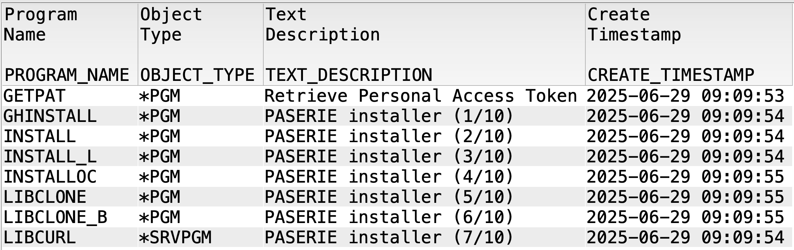

<div style="page-break-after: always;"></div>

## HINTS FOR DEVELOPERS

The minimum provision to enable `PASERIE/INSTALL` handling your "native" IBM i GitHub repository is:

* creating a file named `GUIDANCE.TXT` in the root of the repository and
* creating a directory named `QCLSRC` and a `QCLSRC/BUILD.CLLE` ILE CL source 

The installer will use the token passed 
with **YOURGITPDA** (*GitHub personal access token*) 
to access GitHub APIs and download `GUIDANCE.TXT` in memory. 
The content is a list of member files that 
will be created in the `QTEMP` of the batch job.
Once all files are transfered the job will attempt the compilation of
QTEMP/QCLSRC(BUILD) member file into QTEMP/BUILD \*PGM.
If successful, it will pass control to your build procedure.

The expected input parameters of a well\-behaving `QCLSRC/BUILD.CLLE` are the 
following (in this order):

``` 
 DCL VAR(&DEVOPT) TYPE(*CHAR) LEN(1)
 DCL VAR(&TGTRLS) TYPE(*CHAR) LEN(10)
 DCL VAR(&TGTLIB) TYPE(*CHAR) LEN(10)
```

that default to `'N'`, `'*CURRENT'`, and `'*PACKAGEN'` if not set in
`PASERIE/INSTALL`, or `PASERIE/INSTALLOC`, corresponding parameters.

The `PASERIE/LIBCLONE` utility generates a directory with all the required
PASERIE\-related objects. It also introduces a dependency on the `TMKMAKE`
utility (from `QUSRTOOL` library). I have re\-packaged it for a plain 
installation with `PASERIE/INSTALL` (please contact me if you need help
in installing it: `andrea.ribuoli@yahoo.com`)  

<div style="page-break-after: always;"></div>

## HANDS ON

### JUMP\-START

Let us take confidence with `PASERIE/LIBCLONE`.

First we create a new native library named **SIMPLE**:

`CRTLIB LIB(SIMPLE)`

Now we create a source file named **QCLSRC** with a member named **GREETINGS**:

```
CRTSRCPF FILE(SIMPLE/QCLSRC)                       
         MBR(GREETINGS)                            
         TEXT('Help me understand PASERIE tools')  
``` 

Let us assign the `CLLE` SEU\-type to our member file:

`CHGPFM FILE(SIMPLE/QCLSRC) MBR(GREETINGS) SRCTYPE(CLLE)`

Let us edit the source file:

`EDTF FILE(SIMPLE/QCLSRC) MBR(GREETINGS)`

and enter a simple CL source like:

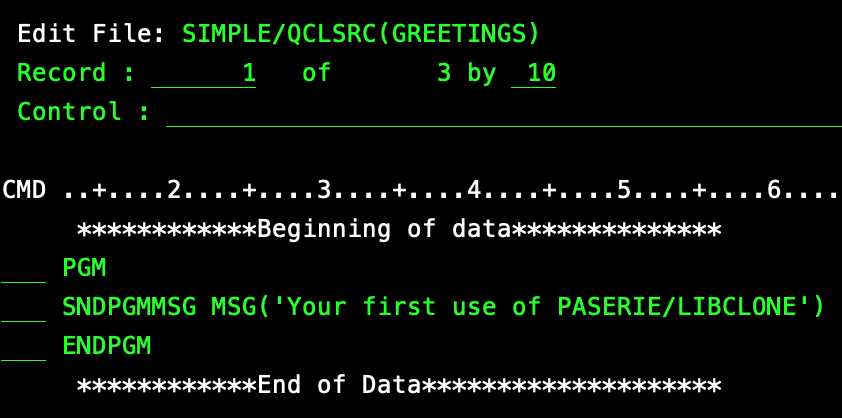

Now we issue the following command:

`PASERIE/LIBCLONE SRCLIB(SIMPLE)`

We should receive:

```
 Selection or command  
 ===>                  
                       
 F3=Exit   F4=Prompt   
 F23=Set initial menu  
 LIBCLONE_B completed. 
```
 
 Now let us run `WRKLNK OBJ(SIMPLE)` and use option `5` to enter the directory. We should find:
 
 ```
 Opt   Object link            Type     Attribute    Text  
       GUIDANCE.TXT           STMF                        
       QCLSRC                 DIR                         
       QMAKSRC                DIR                         
 ```
 
 The content of `GUIDANCE.TXT` will be:
 
 ```
  ************Beginning of data**************                       
QCLSRC    GREETINGS CLLE      Help me understand PASERIE tools     
QCLSRC    BUILD     CLLE      BUILD CLLE auto-generated            
QMAKSRC   BUILD     TXT       BUILD Makefile auto-generated        
 ************End of Data********************                       
 ```
 
 Inside `QCLSRC` directory you will find two source members:
 
```
Opt   Object link            Type  
      BUILD.CLLE             STMF  
      GREETINGS.CLLE         STMF   
```

And there is also a `QMAKSRC` with a `BUILD`
member. 

Assuming you have a `TMKMAKE` library with a working `TMKMAKE` command you will be able to run successfully:

`PASERIE/INSTALLOC LOCAL_PATH(SIMPLE)`

Now issuing `CALL PGM(SIMPLE/GREETINGS)` we will get:

```
Selection or command              
===>                              
                                  
F3=Exit   F4=Prompt   F9=Retrieve 
F23=Set initial menu              
Your first use of PASERIE/LIBCLONE
```     

<div style="page-break-after: always;"></div>

### RELEASE ON GitHub

Now let us suppose we want to proceed with our development tracking any future change we will operate on our source code.
Also let us assume we want to adopt **git** and **GitHub**.

You should have a GitHub account and you will create an empty repository named **SIMPLE**:

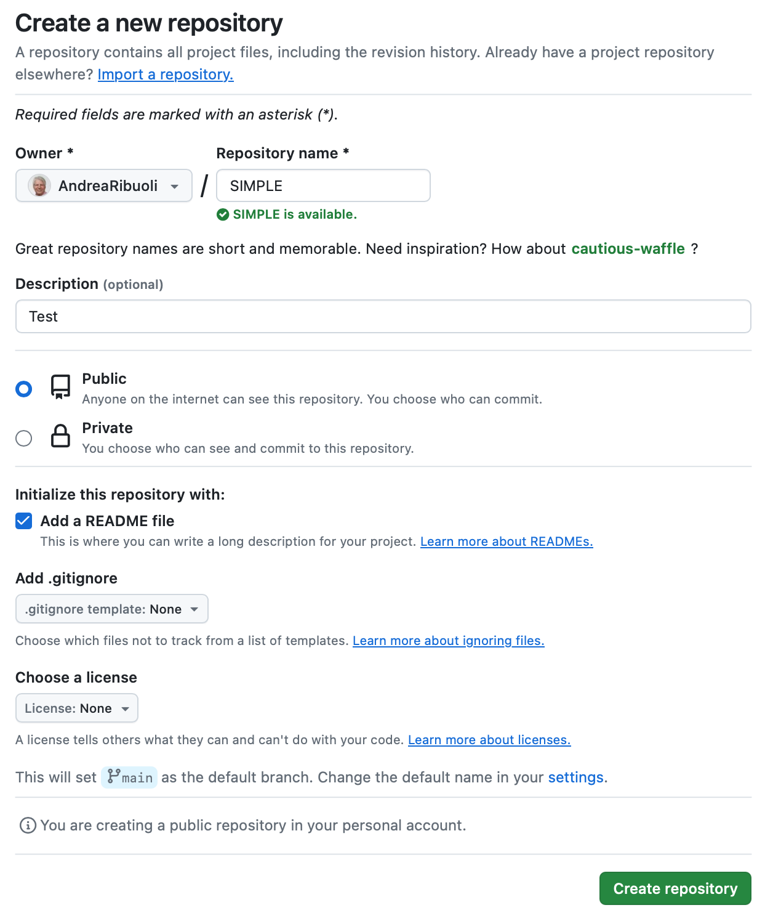

Now you need to access your IBM i home directory from an SSH terminal session.

Having `git` available in our **PATH** environment variable, we will issue the following commands
(you will replace *AndreaRibuoli* with your actual GitHub user profile):

```
cd SIMPLE
git init
git branch -M main
git remote add origin https://github.com/AndreaRibuoli/SIMPLE.git
git pull origin main --allow-unrelated-histories
git add .
git commit -m 'my initial SIMPLE project'
git push --set-upstream origin main
``` 

During the final *push* you will be required to enter **Username** and corresponding **Password**.

In my case:

```
Username for 'https://github.com': 
Password for 'https://AndreaRibuoli@github.com': 
Enumerating objects: 9, done.
Counting objects: 100% (9/9), done.
Delta compression using up to 4 threads
Compressing objects: 100% (7/7), done.
Writing objects: 100% (8/8), 1.49 KiB | 381.00 KiB/s, done.
Total 8 (delta 0), reused 0 (delta 0), pack-reused 0
To https://github.com/AndreaRibuoli/SIMPLE.git
   9c6ed28..30ed311  main -> main
branch 'main' set up to track 'origin/main'.
```

You will find your repository updated on GitHub:

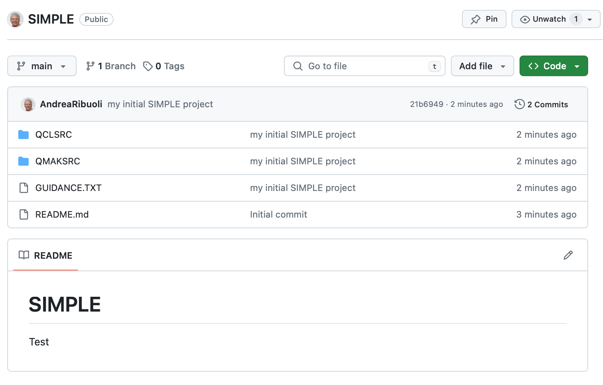

<div style="page-break-after: always;"></div>

### DISTRIBUTE

Everything is ready to install on a different IBM i system where PASERIE has been already installed
(again, replace *AndreaRibuoli* with your GitHub username):

```
PASERIE/INSTALL REPO_OWNER(AndreaRibuoli)
                REPOSITORY(SIMPLE)     
                YOURGITPAT('ghp_your__40__bytes_long__personal_token')             
```

Rather than passing your GitHub token you can adopt the default `*GETPAT`.
This will call PASERIE/GETPAT. 

You should use `RTVCLSRC` to extract the CLLE source code:

```
     PGM PARM(&GITTOKEN)                                  
     DCL VAR(&GITTOKEN) TYPE(*CHAR) LEN(40)               
     RTVDTAARA DTAARA(GITTOKEN (1 40)) RTNVAR(&GITTOKEN)  
     ENDPGM                                               
```

If you are fine in using it **as\-is** store your token in the **GITTOKEN** data area:

```
CRTDTAARA DTAARA(GITTOKEN) TYPE(*CHAR) LEN(40) 
          VALUE('ghp_your__40__bytes_long__personal_token')  
```           

This will enable you to simply issue:

```
PASERIE/INSTALL REPO_OWNER(AndreaRibuoli) REPOSITORY(SIMPLE)    
``` 

<div style="page-break-after: always;"></div>

## CURRENTLY SUPPORTED VERSIONS

**PASERIE** currently supports **IBM i PASE** from **6.1** to *7.6*
but I am working on extending the coverage even to IBM i *5.4* 
to facilitate reuse of code originally developed 
on very old versions of the operating system.

```
╔════════════╦═════════════╦═════════╤═══════════╤══════════╗
║ IBM i PASE ║     AIX     ║ INSTALL │ INSTALLOC │ LIBCLONE ║
╠════════════╬═══════╤═════╬═════════╪═══════════╪══════════╣
║     7.6    ║  7.3  │ TL1 ║   yes   │    yes    │    yes   ║
╟────────────╫───────┼─────╫─────────┼───────────┼──────────╢
║     7.5    ║       │ TL5 ║   yes   │    yes    │    yes   ║
╟────────────╢  7.2  ├─────╫─────────┼───────────┼──────────╢
║     7.4    ║       │ TL2 ║   yes   │    yes    │    yes   ║
╟────────────╫───────┼─────╫─────────┼───────────┼──────────╢
║     7.3    ║       │ TL4 ║   yes   │    yes    │    yes   ║
╟────────────╢  7.1  ├─────╫─────────┼───────────┼──────────╢
║     7.2    ║       │ TL1 ║   yes   │    yes    │    yes   ║
╟────────────╫───────┼─────╫─────────┼───────────┼──────────╢
║     7.1    ║  6.1  │ TL2 ║   yes   │    yes    │    yes   ║
╟────────────╫───────┼─────╫─────────┼───────────┼──────────╢
║     6.1    ║       │ TL6 ║   yes   │    yes    │    yes   ║
╟────────────╢  5.3  ├─────╫─────────┼───────────┼──────────╢
║     5.4    ║       │ ML3 ║         │    yes    │    yes   ║
╚════════════╩═══════╧═════╩═════════╧═══════════╧══════════╝
```

* **TR** *Technology Refresh (IBM i)*
* **TL** *Technology Level (AIX)*
* **ML** *Modification Level (AIX)*

*Note*: Starting in 2006, as part of the new *AIX 5L Service Strategy*, **ML**s were replaced by **TL**s

<div style="page-break-after: always;"></div>

## INSTALLATION WITHOUT bash OR git OR curl

If you do not have **bash**, **git** or **curl** installed in your *PASE* environment
it is possible you are still using an IBM i old version.

The following steps support installing PASERIE in IBM i **6.1**, **7.1** and **7.2**.

By means of a PC connected to the Internet, select the follwing URL and download the linked item:
                                                                      
[https://www.andrearibuoli.it](https://www.andrearibuoli.it/paserie/PaseOssPre730.tar)    

You will find the tar file in the *Download* folder .

Now access the following link and save the *zip* file of the GitHub PASERIE repository:

[https://github.com](https://github.com/AndreaRibuoli/PASERIE/archive/refs/heads/main.zip)

Untar and unzip the two folders and transfer them to your IBM i home directory.
 
Connect via a 5250 emulator using your user profile.

From `CALL QP2TERM` you will change directory into the repository copy and run the
installer like this: 
 
```
cd PASERIE
sh ./bootstrap.sh
```

After exiting from the QP2TERM session you should have **PASERIE** utilities ready for use. 
