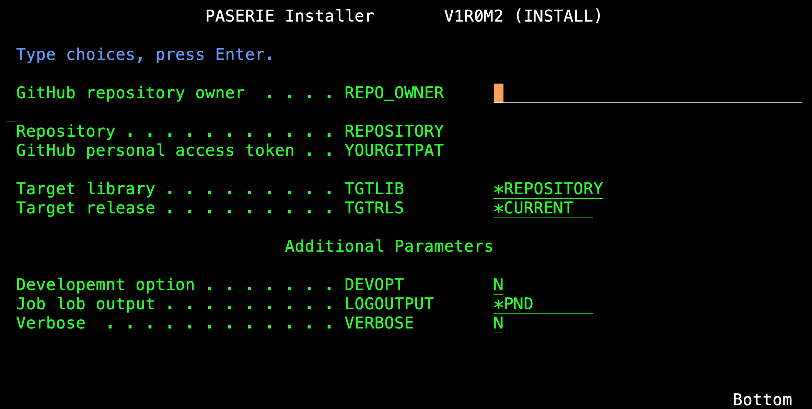
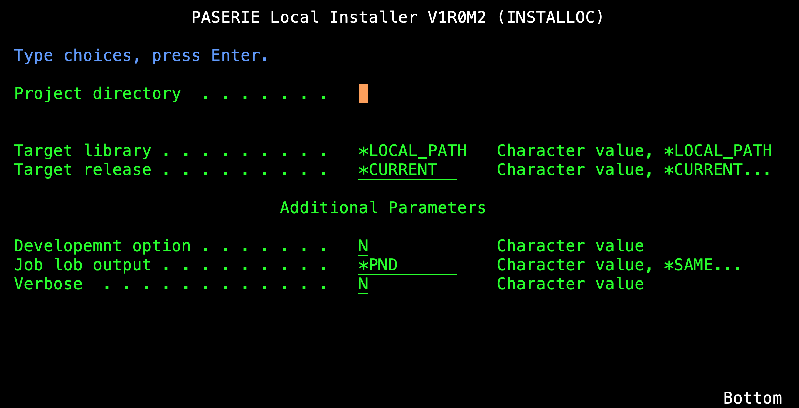
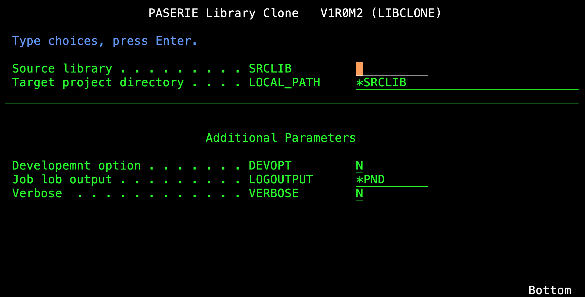

# PASERIE (V1R0M9)
### Utility for Source-Level Distribution in IBM i

This utility helps you maintain your IBM i source code on GitHub.
Once available on a target system, the utility allows you to install your packages 
in a very simple way, directly accessing your repositories on GitHub
or the repositories of other developers that authorized you.

The suite provides a total of three commands:

* For end users of a package:
  *  **PASERIE/INSTALL** the main command focusing on the installation phase of an already developed and GitHub-released package.
* For developers:
  *  **PASERIE/INSTALLOC** the command used in the development phase to test the installation of a package (planned to be released on GitHub or not) directly from a directory in the IFS.
  *  **PASERIE/LIBCLONE** the command used to jump\-start the packaging (consistently with PASERIE tools' conventions) from an existing native library. 

```
    from GitHub                  from IFS 
┌────────────────┐          ┌────────────────┐    
│                ├┐         │                ├┐   
│                ││         │                ││   
│                ││         │                ││   
│                ││         │                ││   
│                ││         │                ││   
└┬──────\\───────┘│         └┬──────//───────┘│
 └───────\\───────┘          └─────//─────────┘  
          \\                      //
        INSTALL               INSTALLOC
            \\                  //
             \\                //
              ┌────────────────┐
              │                │
              │   Q T E M P    │     (GUIDANCE.TXT lists source members)
              │                │
              └────────────────┘
                     
              QTEMP/QCLSRC(BUILD)    (compiled on the fly and executed)   
```

## INSTALLATION

Let's first create an empty SAVEFILE named `QGPL/PASERIE`:
```
CRTSAVF FILE(QGPL/PASERIE) TEXT('Paserie Save File')
```
Then, from `CALL QP2TERM`, we verify that **curl** is installed:

```
  $                                        
> PATH=/QOpenSys/pkgs/bin:$PATH            
  $                                        
> export PATH                              
  $         
> which curl
  /QOpenSys/pkgs/bin/curl
```
Using curl, we download 2 archives:
                                                                      

```                  
curl -o PaseOssFloating.tar
        https://www.andrearibuoli.it/paserie/PaseOssFloating.tar    
```
        
```                  
curl -o /QSYS.LIB/QGPL.LIB/PASERIE.FILE
        https://www.andrearibuoli.it/paserie/PASERIE.SAVF
```

From the home path of the user that will be using **PASERIE/INSTALL** we
install **PaseOss** folder by untarring *PaseOssFloating* tar file:

```
cd ~
tar xvf PaseOssFloating.tar
```

Now, after exiting from the QP2TERM session, we can perform the `RSTLIB` for PASERIE:
```
RSTLIB SAVLIB(PASERIE) DEV(*SAVF) SAVF(QGPL/PASERIE)
```

## PARAMETERS FOR THE THREE COMMANDS WITH SCREEN SHOTS

|     KWD    |  INSTALL  | INSTALLOC | LIBCLONE  |
|:-----------|:---------:|:---------:|:---------:|
| REPO_OWNER |    yes    |           |           | 
| REPOSITORY |    yes    |           |           | 
| YOURGITPAT |    yes    |           |           | 
| SRCLIB     |           |           |    yes    | 
| LOCALPATH  |           |    yes    |    yes    | 
| TGTLIB     |    yes    |    yes    |           | 
| TGTRLS     |    yes    |    yes    |           | 
| DEVOPT     |    yes    |    yes    |    yes    | 
| LOGOUTPUT  |    yes    |    yes    |    yes    | 
| VERBOSE    |    yes    |    yes    |    yes    | 








## THE NAME

pastry ==> *pâ-tis-se-rie* ==> **PASERIE**

## HINTS FOR DEVELOPERS

The minimum provision to enable `PASERIE/INSTALL` handling your "native" IBM i GitHub repository is:

* creating a file named `GUIDANCE.TXT` in the root of the repository and
* creating a directory named `QCLSRC` and a `QCLSRC/BUILD.CLLE` ILE CL source 

The installer will use the token passed 
with **YOURGITPDA** (*GitHub personal access token*) 
to access GitHub APIs and download `GUIDANCE.TXT` in memory. 
The content is a list of member files that 
will be created in the `QTEMP` of the batch job.
Once all files are transfered the job will attempt the compilation of
QTEMP/QCLSRC(BUILD) member file into QTEMP/BUILD \*PGM.
If successful, it will pass control to your build procedure.

The expected input parameters of a well\-behaving `QCLSRC/BUILD.CLLE` are the 
following (in this order):

``` 
 DCL VAR(&DEVOPT) TYPE(*CHAR) LEN(1)
 DCL VAR(&TGTRLS) TYPE(*CHAR) LEN(10)
 DCL VAR(&TGTLIB) TYPE(*CHAR) LEN(10)
```

that default to `'N'`, `'*CURRENT'`, and `'*PACKAGEN'` if not set in
`PASERIE/INSTALL`, or `PASERIE/INSTALLOC`, corresponding parameters.

The `PASERIE/LIBCLONE` utility generates a directory with all the required
PASERIE\-related objects. It also introduces a dependency on the `TMKMAKE`
utility (from `QUSRTOOL` library). I have re\-packaged it for a plain 
installation with `PASERIE/INSTALL` (please contact me if you need help
in installing it: `andrea.ribuoli@yahoo.com`)  


